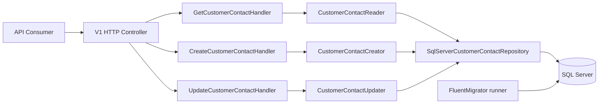
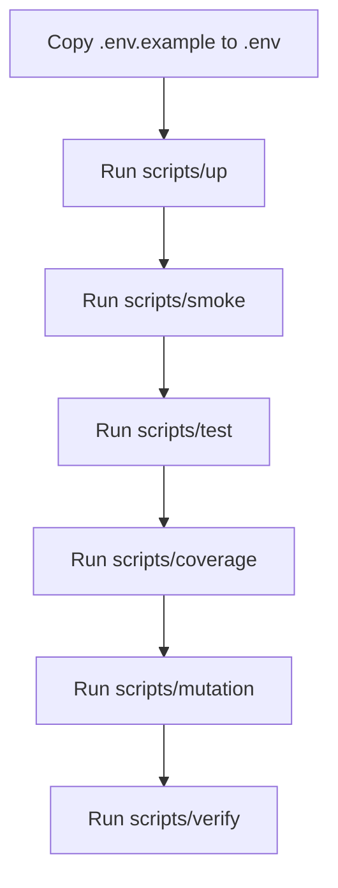

# AIDA Parallel Change Workshop

This repository simulates day-to-day API evolution work under strict compatibility constraints.

- Runtime: .NET 10, ASP.NET Core, SQL Server, Dapper, FluentMigrator.
- Branch model: single long-lived branch, `main`.
- Initial API surface:
  - `GET /api/v1/customer-contacts/{customerId}`
  - `POST /api/v1/customer-contacts`
  - `PUT /api/v1/customer-contacts/{customerId}`

## Prerequisites

- .NET 10 SDK
- Docker Engine or Docker Desktop with `docker compose`
- PowerShell 7+ for `*.ps1` scripts (optional)

## Architecture at a glance



## Execution flow



## Quick start from zero

1) Clone and enter the repository.

2) Create local configuration file:

```bash
cp .env.example .env
```

3) Start services, apply migrations, and boot API:

```bash
./scripts/up.sh
```

4) Run smoke checks (scenario + health + OpenAPI):

```bash
./scripts/smoke.sh
```

5) Stop everything:

```bash
./scripts/down.sh
```

PowerShell equivalents are available for each script (`*.ps1`).

## Environment variables

Scripts read `.env` when present. Defaults are defined in `scripts/common.sh` and `scripts/common.ps1`.

Key variables:

- `AIDA_SQL_DATABASE`
- `AIDA_SQL_USER`
- `AIDA_SQL_PASSWORD`
- `AIDA_SQL_PORT`
- `AIDA_API_PORT`
- `AIDA_HTTP_ENV_FILE`
- `AIDA_HTTP_ENV`

## OpenAPI and health endpoints

- Health check: `GET /health`
- OpenAPI document: `GET /openapi/v1.json`

Both endpoints are validated in acceptance tests and `.http` smoke scripts.

## Executable HTTP documentation

Main contract requests:

- `http/v1/customer-contacts/get-customer-contact-200.http`
- `http/v1/customer-contacts/get-customer-contact-400.http`
- `http/v1/customer-contacts/get-customer-contact-404.http`
- `http/v1/customer-contacts/create-customer-contact-201.http`
- `http/v1/customer-contacts/create-customer-contact-400.http`
- `http/v1/customer-contacts/create-customer-contact-409.http`
- `http/v1/customer-contacts/update-customer-contact-204.http`
- `http/v1/customer-contacts/update-customer-contact-400.http`
- `http/v1/customer-contacts/update-customer-contact-404.http`

System requests:

- `http/system/health-200.http`
- `http/system/openapi-v1-200.http`

Smoke scenario:

- `http/v1/customer-contacts/scenario-create-get-update-get.http`

## Scripts

- `scripts/up.*`: build images, start SQL/API, recreate database, run migrations.
- `scripts/down.*`: stop and remove containers.
- `scripts/migrate.*`: start SQL, recreate database, run migrator only.
- `scripts/smoke.*`: execute smoke `.http` requests through `ijhttp` container.
- `scripts/test.*`: run fast test suite (`TestCategory!=NarrowIntegration`).
- `scripts/coverage.*`: enforce line and branch coverage thresholds.
- `scripts/mutation.*`: run Stryker mutation testing.
- `scripts/check-shell-eol.*`: enforce LF-only for `*.sh`.
- `scripts/verify.*`: end-to-end local quality gate.
- `scripts/workshop-replay.*`: replay commit history (`--dry-run`, `--auto`, `--delay`).

## Quality gates

```bash
dotnet restore Aida.ParallelChange.sln
dotnet build Aida.ParallelChange.sln -c Release
./scripts/check-shell-eol.sh
./scripts/test.sh
dotnet test Aida.ParallelChange.sln -c Release --filter "TestCategory=NarrowIntegration"
./scripts/coverage.sh
./scripts/mutation.sh
./scripts/up.sh
./scripts/smoke.sh
./scripts/down.sh
```

## Workshop operating rules

- Work as in production day-to-day, not as a toy exercise.
- Keep backward compatibility for existing consumers.
- Use OpenAPI continuously while evolving contracts.
- Follow small TDD cycles and refactor tests and production code together.
- Keep commits small and explicit (phase + intent + rationale).

## Documentation map

- `AGENTS.md`
- `docs/INSTRUCTIONS.md`
- `docs/DOCUMENTATION.md`
- `docs/FACILITATION.md`
- `docs/adr/`
- `to-do.md`
