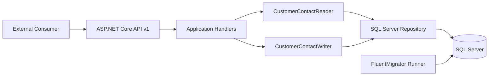
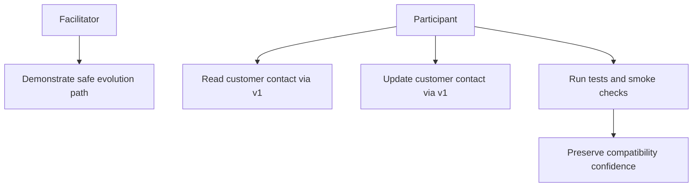
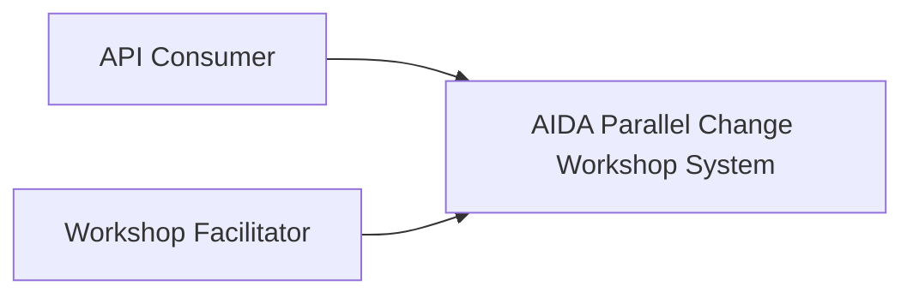
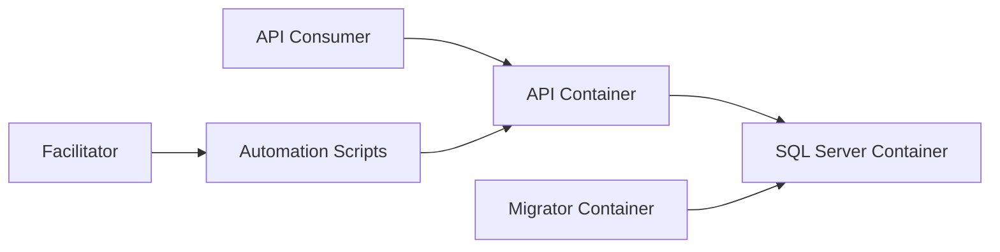
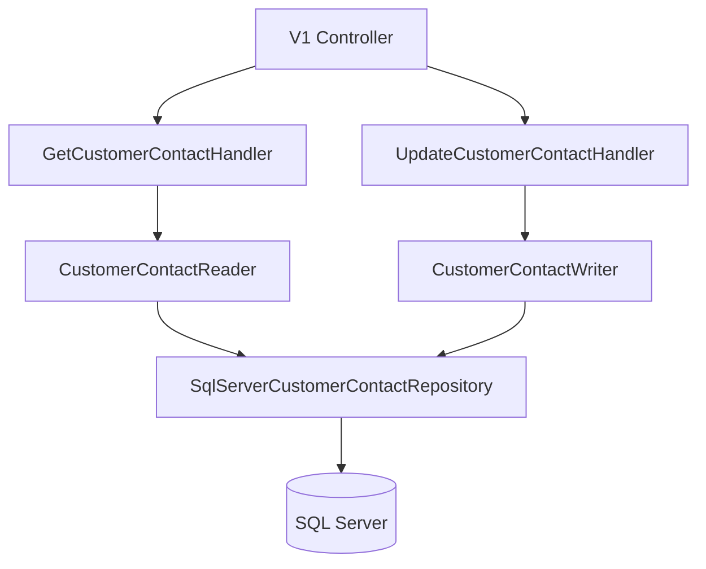
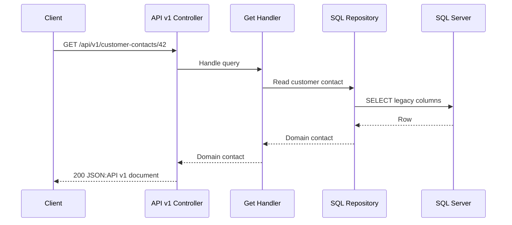
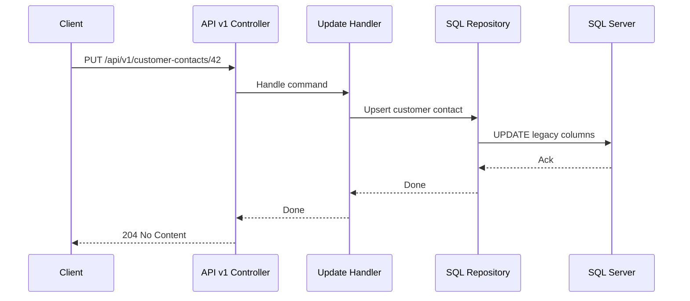

# AIDA Parallel Change Workshop

This repository is a hands-on workshop to practice safe contract and data evolution in a .NET 10 HTTP API with unknown consumers.

The workshop follows a strict parallel change journey:

1. `workshop/initial-state`
2. `workshop/expand`
3. `workshop/migrate`
4. `workshop/contract`

This README belongs to `main`.

## What participants build

The initial contract is a legacy flat JSON:API payload for customer contact data:

- `contactName`
- `phone`
- `email`

The final target is a structured contract introduced safely in later branches.

## Workshop branch setup

```bash
git checkout workshop/initial-state
git checkout -b team-x-solution
```

`main` keeps the shared baseline tooling and documentation used by every workshop branch.

## Runtime commands

Linux or macOS:

```bash
./scripts/up.sh
./scripts/smoke.sh
./scripts/down.sh
```

Windows PowerShell:

```powershell
pwsh ./scripts/up.ps1
pwsh ./scripts/smoke.ps1
pwsh ./scripts/down.ps1
```

## Quality commands

```bash
./scripts/test.sh
./scripts/verify.sh
```

## Branch navigation

```bash
./workshop-branch.sh list
./workshop-branch.sh goto expand
./workshop-branch.sh next
```

```powershell
./workshop-branch.ps1 list
./workshop-branch.ps1 goto migrate
./workshop-branch.ps1 next
```

## Additional automation scripts

- `scripts/test-watch.sh` and `scripts/test-watch.ps1`
- `scripts/god-mode.sh` and `scripts/god-mode.ps1`
- `scripts/workshop-replay.sh` and `scripts/workshop-replay.ps1`
- `scripts/verify-history.sh` and `scripts/verify-history.ps1`
- `scripts/clean-docker.sh` and `scripts/clean-docker.ps1`

## HTTP requests used as executable docs

- `http/v1/get-customer-contact.http`
- `http/v1/update-customer-contact.http`
- `http/environments/local.http-client.env.json`

## Documentation map

- `docs/INSTRUCTIONS.md`
- `docs/DOCUMENTATION.md`
- `docs/FACILITATION.md`
- `docs/adr/ADR-001.md`
- `docs/adr/ADR-002.md`
- `docs/adr/ADR-003.md`
- `AGENTS.md`

## Architecture Overview



## Use Cases



## C4 Level 1



## C4 Level 2



## C4 Level 3



## C4 Level 4

```mermaid
flowchart LR
  GetEndpoint[GET /api/v1/customer-contacts/{id}] --> GetQuery[GetCustomerContactQuery]
  PutEndpoint[PUT /api/v1/customer-contacts/{id}] --> UpdateCommand[UpdateCustomerContactCommand]
  GetQuery --> Domain[CustomerContact Domain Model]
  UpdateCommand --> Domain
  Domain --> SqlMapper[SQL Mapper]
  SqlMapper --> Sql[(customer_contacts)]
```

## Endpoint Sequences

### GET v1



### PUT v1



## Validation baseline

```bash
dotnet restore Aida.ParallelChange.sln
dotnet build Aida.ParallelChange.sln -c Release
dotnet test Aida.ParallelChange.sln -c Release
./scripts/up.sh
./scripts/smoke.sh
./scripts/down.sh
```
