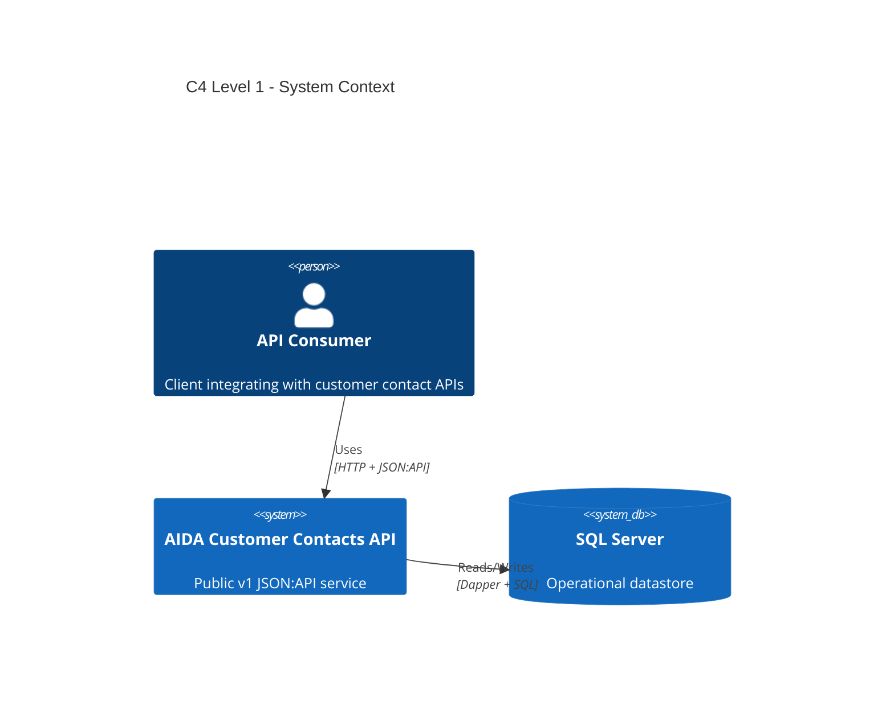
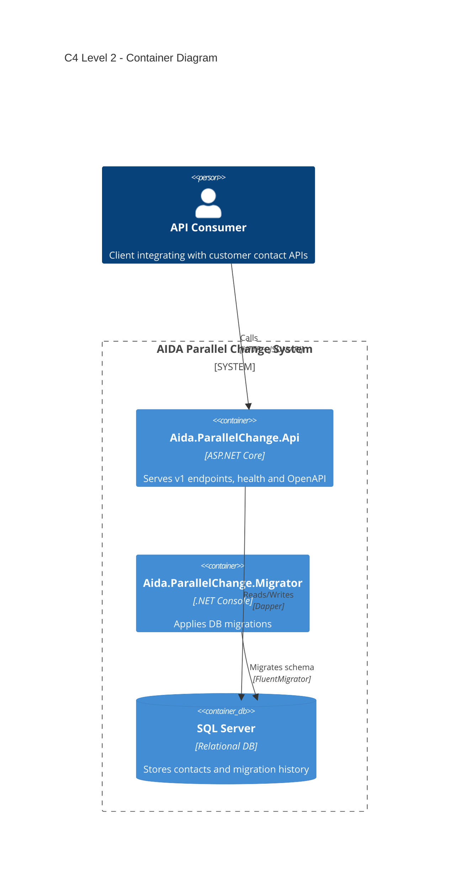
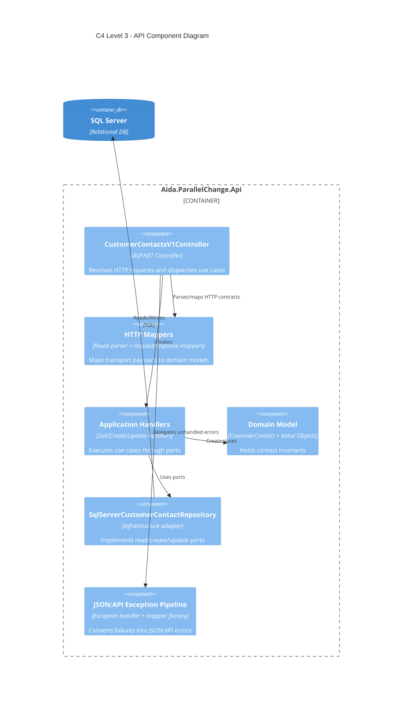

[](https://github.com/evalverde-eng/aida-parallel-changes-workshop/actions/workflows/quality-gates.yml)
# AIDA Parallel Change Workshop

This repository is a workshop baseline to practice safe contract and persistence evolution with strict engineering discipline.

- Runtime stack: .NET 10, ASP.NET Core, SQL Server, Dapper, FluentMigrator.
- Branch model: single long-lived branch `main`.
- Public baseline API:
  - `GET /api/v1/customer-contacts/{customerId}`
  - `POST /api/v1/customer-contacts`
  - `PUT /api/v1/customer-contacts/{customerId}`
  - `GET /health`
  - `GET /openapi/v1.json`

## Repository objective

The workshop objective is to evolve a live system incrementally without careless breaking changes.

- Keep legacy behavior stable while introducing new behavior.
- Keep tests, docs, scripts, and HTTP executable documentation aligned.
- Work with outside-in double-loop TDD and one failing test at a time.

## Architecture (C4)

These diagrams show the current implemented architecture at three levels of detail.

### C4 Level 1 - System Context

Focus: who uses the system and which external system it depends on.



### C4 Level 2 - Container Diagram

Focus: deployable units in this repository and their runtime responsibilities.



### C4 Level 3 - Component Diagram (API Container)

Focus: main API components and dependency flow inside `Aida.ParallelChange.Api`.



## Documentation map

- `AGENTS.md`
- `to-do.md`
- `docs/INSTRUCTIONS.md`
- `docs/DOCUMENTATION.md`
- `docs/FACILITATION.md`
- `docs/adr/*.md`

## Prerequisites

- .NET 10 SDK
- Docker Engine or Docker Desktop with `docker compose`
- PowerShell 7+ for `*.ps1` scripts (optional)
- JetBrains Rider 2024.3+ for shared `.run` configurations and `.http` execution (optional)

## Fixed system port

API HTTP port is fixed to `8080`.

- Local URL: `http://localhost:8080`
- System checks:
  - `http://localhost:8080/health`
  - `http://localhost:8080/openapi/v1.json`

## HTTP executable documentation layout

All request files and environment definitions are in the same folder:

- `http/*.http`
- `http/http-client.env.json`

Available environments in `http/http-client.env.json`:

- `local` for IDE/host execution (`http://localhost:8080`)
- `docker` for Docker network execution (`http://api:8080`)
- `localFromDocker` for Docker-based HTTP runner targeting host API (`http://host.docker.internal:8080`)

## Environment variables

Scripts load `.env` when present. Start from `.env.example`.

- `AIDA_SQL_DATABASE`
- `AIDA_SQL_USER`
- `AIDA_SQL_PASSWORD`
- `AIDA_SQL_PORT`
- `AIDA_API_PORT`
- `AIDA_SQL_READY_ATTEMPTS`
- `AIDA_SQL_READY_SLEEP_SECONDS`
- `AIDA_HTTP_ENV_FILE`
- `AIDA_HTTP_ENV`
- `AIDA_COMPOSE_PROJECT_NAME`

`AIDA_COMPOSE_PROJECT_NAME` groups compose resources under one project name.
`AIDA_API_PORT` controls host-to-container API port mapping in Docker and defaults to `8080`.
Manual Docker commands below use `-p aida-parallel-change` for shell compatibility; change that value if you need a different compose project name.

## Manual-first operation guide

This section intentionally lists direct manual commands before script shortcuts.

### 1) Restore dependencies manually

```bash
dotnet restore src/Aida.ParallelChange.Api/Aida.ParallelChange.Api.csproj
dotnet restore src/Aida.ParallelChange.Migrator/Aida.ParallelChange.Migrator.csproj
dotnet restore tests/Aida.ParallelChange.Api.Tests/Aida.ParallelChange.Api.Tests.csproj
```

### 2) Bring Docker stack up manually (full flow)

```bash
docker compose -p aida-parallel-change build ijhttp
docker compose -p aida-parallel-change build migrator
docker compose -p aida-parallel-change up --build -d sqlserver
docker compose -p aida-parallel-change run --rm migrator
docker compose -p aida-parallel-change up --build -d api
```

Quick validation:

```bash
curl http://localhost:8080/health
curl http://localhost:8080/openapi/v1.json
```

### 3) Execute all `.http` manually with Docker HTTP client runner

This repository intentionally uses one ephemeral `ijhttp` container per request (`run --rm`) to guarantee isolated executions.

Docker environment:

```bash
for request in http/*.http; do
  docker compose -p aida-parallel-change run --rm ijhttp --env-file http/http-client.env.json --env docker "$request"
done
```

Local host environment through Docker HTTP client runner:

```bash
for request in http/*.http; do
  docker compose -p aida-parallel-change run --rm ijhttp --env-file http/http-client.env.json --env localFromDocker "$request"
done
```

### 4) Stop Docker stack manually

```bash
docker compose -p aida-parallel-change down --remove-orphans
```

### 5) Migrations only (manual)

```bash
docker compose -p aida-parallel-change up -d sqlserver
docker compose -p aida-parallel-change build migrator
docker compose -p aida-parallel-change run --rm migrator
```

### 6) Run API locally without Docker stack scripts

Using SQL Server available locally:

```bash
export ConnectionStrings__SqlServer="Server=localhost,14333;Database=AidaParallelChange;User Id=sa;Password=Your_strong_password_123;TrustServerCertificate=true;Encrypt=false"
dotnet run --project src/Aida.ParallelChange.Migrator
dotnet run --project src/Aida.ParallelChange.Api
```

PowerShell equivalent:

```powershell
$env:ConnectionStrings__SqlServer="Server=localhost,14333;Database=AidaParallelChange;User Id=sa;Password=Your_strong_password_123;TrustServerCertificate=true;Encrypt=false"
dotnet run --project src/Aida.ParallelChange.Migrator
dotnet run --project src/Aida.ParallelChange.Api
```

### 7) Manual quality commands

```bash
dotnet restore Aida.ParallelChange.sln
dotnet build Aida.ParallelChange.sln -c Release -warnaserror
dotnet test Aida.ParallelChange.sln -c Release --filter "TestCategory!=NarrowIntegration"
dotnet test Aida.ParallelChange.sln -c Release --filter "TestCategory=NarrowIntegration"
dotnet test tests/Aida.ParallelChange.Api.Tests/Aida.ParallelChange.Api.Tests.csproj -c Release --filter "TestCategory!=NarrowIntegration" /p:CollectCoverage=true /p:CoverletOutputFormat=json
```

Mutation manually:

```bash
dotnet tool install dotnet-stryker --tool-path ./.tools --version 4.13.0
.tools/dotnet-stryker --config-file stryker-config.json --output artifacts/stryker --log-to-file
```

## Script shortcuts

All required script families exist in shell and PowerShell variants:

- `scripts/up.*`
- `scripts/down.*`
- `scripts/migrate.*`
- `scripts/smoke.*`
- `scripts/restore.*`
- `scripts/test.*`
- `scripts/coverage.*`
- `scripts/mutation.*`
- `scripts/verify.*`
- `scripts/check-shell-eol.*`

Typical script flow:

```bash
cp .env.example .env
./scripts/up.sh
./scripts/smoke.sh
./scripts/down.sh
```

PowerShell equivalents:

```powershell
Copy-Item .env.example .env
./scripts/up.ps1
./scripts/smoke.ps1
./scripts/down.ps1
```

## Rider configuration and usage

Shared run configurations are committed under `.run/`:

- `Docker Up` (direct `docker compose ... up -d --build` command)
- `Docker Down` (direct `docker compose ... down --remove-orphans` command)
- `HTTP Smoke Docker` (direct compose `run --rm` loop against `docker` env)
- `HTTP Smoke Local` (direct compose `run --rm` loop against `localFromDocker` env)
- `Verify Local`

For IDE-native `.http` execution:

1. Open any request in `http/*.http`.
2. In Rider HTTP client, select environment `local` or `docker` from `http/http-client.env.json`.
3. Run individual requests or run all requests in the file.

## GitHub Actions and local validation with act

Workflow file: `.github/workflows/quality-gates.yml`

- Triggered on every `push` branch.
- Triggered on `pull_request`.
- Supports `workflow_dispatch` with `scope` input (`all`, `build`, `tests`, `mutation`).

### Install act

Linux/macOS via official installer script:

```bash
curl --proto '=https' --tlsv1.2 -sSf https://raw.githubusercontent.com/nektos/act/master/install.sh | sudo bash
```

macOS with Homebrew:

```bash
brew install act
```

Windows with WinGet:

```powershell
winget install --id nektos.act
```

Verify installation:

```bash
act --version
```

### Run workflow locally with act

By job:

```bash
act pull_request -W .github/workflows/quality-gates.yml -j build
act pull_request -W .github/workflows/quality-gates.yml -j tests
act pull_request -W .github/workflows/quality-gates.yml -j mutation
```

By workflow dispatch scope:

```bash
act workflow_dispatch -W .github/workflows/quality-gates.yml --input scope=build
act workflow_dispatch -W .github/workflows/quality-gates.yml --input scope=tests
act workflow_dispatch -W .github/workflows/quality-gates.yml --input scope=mutation
```

## Full DoD command sequence

```bash
dotnet restore Aida.ParallelChange.sln
dotnet build Aida.ParallelChange.sln -c Release -warnaserror
./scripts/check-shell-eol.sh
./scripts/test.sh
./scripts/test.sh
dotnet test Aida.ParallelChange.sln -c Release --filter "TestCategory=NarrowIntegration"
./scripts/coverage.sh
./scripts/mutation.sh
./scripts/up.sh
./scripts/smoke.sh
./scripts/down.sh
./scripts/verify.sh
```

## Troubleshooting

- `./scripts/up.ps1` warning `No resource found to remove for project ...` is treated as non-fatal when Docker returns exit code `0`.
- If Docker HTTP runner needs host API access, use `localFromDocker` environment.
- HTTP smoke intentionally starts one ephemeral `ijhttp` container per request (`run --rm`).
- Runtime API configuration is SQL-only; provide a valid SQL Server connection string for local startup.

## Working rules summary

- Keep changes small and coherent.
- Keep tests behavior-focused.
- Keep docs, scripts, `.http`, and code aligned.
- Treat `AGENTS.md` and `to-do.md` as mandatory operational constraints.
