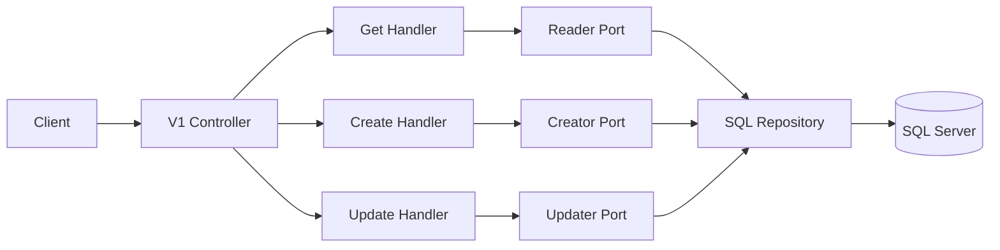
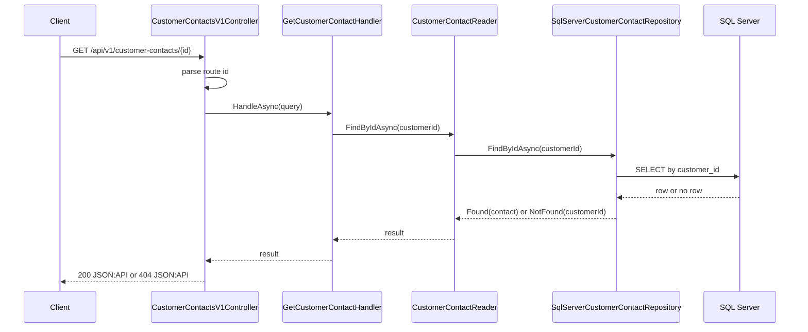
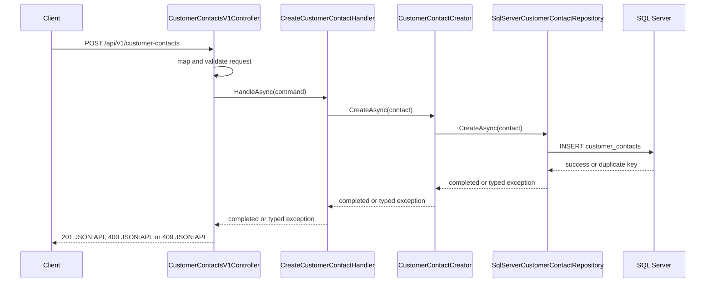
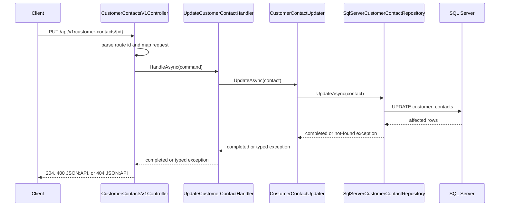

# AIDA Parallel Change Workshop

This repository provides the workshop baseline for evolving an API safely with strict engineering discipline.

- Runtime: .NET 10, ASP.NET Core, SQL Server, Dapper, FluentMigrator.
- Branch model: single long-lived branch `main`.
- Current API baseline:
  - `GET /api/v1/customer-contacts/{customerId}`
  - `POST /api/v1/customer-contacts`
  - `PUT /api/v1/customer-contacts/{customerId}`
  - `GET /health`
  - `GET /openapi/v1.json`

## Documentation map

- `AGENTS.md`
- `to-do.md`
- `docs/INSTRUCTIONS.md`
- `docs/DOCUMENTATION.md`
- `docs/FACILITATION.md`
- `docs/adr/*.md`

## Prerequisites

- .NET 10 SDK
- Docker Engine or Docker Desktop with `docker compose`
- PowerShell 7+ (optional, for `*.ps1` scripts)
- JetBrains Rider 2024.3+ (optional, for shared `.run` configurations)

## Quick start from zero

1. Clone the repository.
2. Create local environment file from example.
3. Start stack and apply migrations.
4. Run executable HTTP documentation checks.
5. Stop stack.

```bash
cp .env.example .env
./scripts/up.sh
./scripts/smoke.sh
./scripts/down.sh
```

PowerShell equivalents are available (`*.ps1`).

## Restore all projects

Use scripts when you want one command from repository root:

```bash
./scripts/restore.sh
```

```powershell
./scripts/restore.ps1
```

Manual alternative (each command starts from repository root and returns to repository root):

```bash
cd src/Aida.ParallelChange.Api && dotnet restore && cd ../..
cd src/Aida.ParallelChange.Migrator && dotnet restore && cd ../..
cd tests/Aida.ParallelChange.Api.Tests && dotnet restore && cd ../..
```

## Environment configuration

Scripts load `.env` when present and apply defaults when missing.

Configure from `.env.example`:

- `AIDA_SQL_DATABASE`
- `AIDA_SQL_USER`
- `AIDA_SQL_PASSWORD`
- `AIDA_SQL_PORT`
- `AIDA_API_PORT`
- `AIDA_SQL_READY_ATTEMPTS`
- `AIDA_SQL_READY_SLEEP_SECONDS`
- `AIDA_HTTP_ENV_FILE`
- `AIDA_HTTP_ENV`
- `AIDA_COMPOSE_PROJECT_NAME`

`AIDA_COMPOSE_PROJECT_NAME` controls the Docker Compose group/project so all services run under the same stack name.

## Runtime flow and architecture



### Sequence diagram: GET



### Sequence diagram: POST



### Sequence diagram: PUT



## Executable HTTP documentation

Contract outcomes in `http/v1/customer-contacts`:

- `get-customer-contact-200.http`
- `get-customer-contact-400.http`
- `get-customer-contact-404.http`
- `create-customer-contact-201.http`
- `create-customer-contact-400.http`
- `create-customer-contact-409.http`
- `update-customer-contact-204.http`
- `update-customer-contact-400.http`
- `update-customer-contact-404.http`
- `scenario-create-get-update-get.http`

System coverage in `http/system`:

- `health-200.http`
- `openapi-v1-200.http`

## Scripts

- `scripts/up.*`: build needed images, start stack, recreate DB, run migrations, boot API.
- `scripts/down.*`: stop and remove compose resources.
- `scripts/migrate.*`: start SQL and run migrations only.
- `scripts/smoke.*`: execute all `.http` docs in `http/system` and `http/v1/customer-contacts`.
- `scripts/restore.*`: restore all project files from repository root.
- `scripts/test.*`: run fast suite (`TestCategory!=NarrowIntegration`).
- `scripts/coverage.*`: enforce 100% line and branch coverage thresholds.
- `scripts/mutation.*`: run Stryker mutation with 100% thresholds.
- `scripts/check-shell-eol.*`: fail on CRLF in `*.sh`.
- `scripts/verify.*`: full local quality gate sequence.

## Rider integration

Shared run configurations are committed under `.run/`:

- `Docker Up`
- `Docker Down`
- `Verify Local`

Recommended Rider flow:

1. Open repository root.
2. Enable Docker integration in Rider.
3. Run `Docker Up`.
4. Run `Verify Local` when needed.
5. Run `Docker Down` to clean stack.

## Quality gates

```bash
dotnet restore Aida.ParallelChange.sln
dotnet build Aida.ParallelChange.sln -c Release -warnaserror
./scripts/check-shell-eol.sh
./scripts/test.sh
dotnet test Aida.ParallelChange.sln -c Release --filter "TestCategory=NarrowIntegration"
./scripts/coverage.sh
./scripts/mutation.sh
./scripts/up.sh
./scripts/smoke.sh
./scripts/down.sh
./scripts/verify.sh
```

## Local GitHub Actions validation

Run workflows locally with `act`:

```bash
act pull_request -W .github/workflows/quality-gates.yml -j build
act pull_request -W .github/workflows/quality-gates.yml -j tests
act pull_request -W .github/workflows/quality-gates.yml -j mutation
```

Pipeline execution is fractionable by job selection (`-j`) and by workflow scope input (`workflow_dispatch`).

## Assertion libraries

- `Shouldly` is available.
- `AwesomeAssertions` is available.
- `FluentAssertions` is intentionally not used as fallback.

## Working rules summary

- Keep changes small and coherent.
- Keep tests behavior-focused.
- Keep docs, scripts, `.http`, and code aligned.
- Treat `AGENTS.md` and `to-do.md` as mandatory operational constraints.
