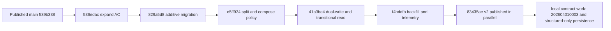
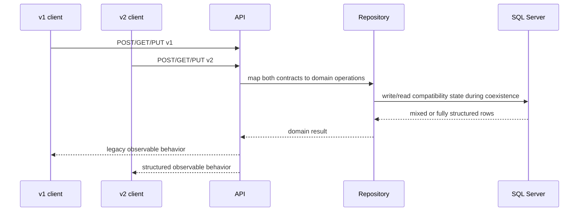
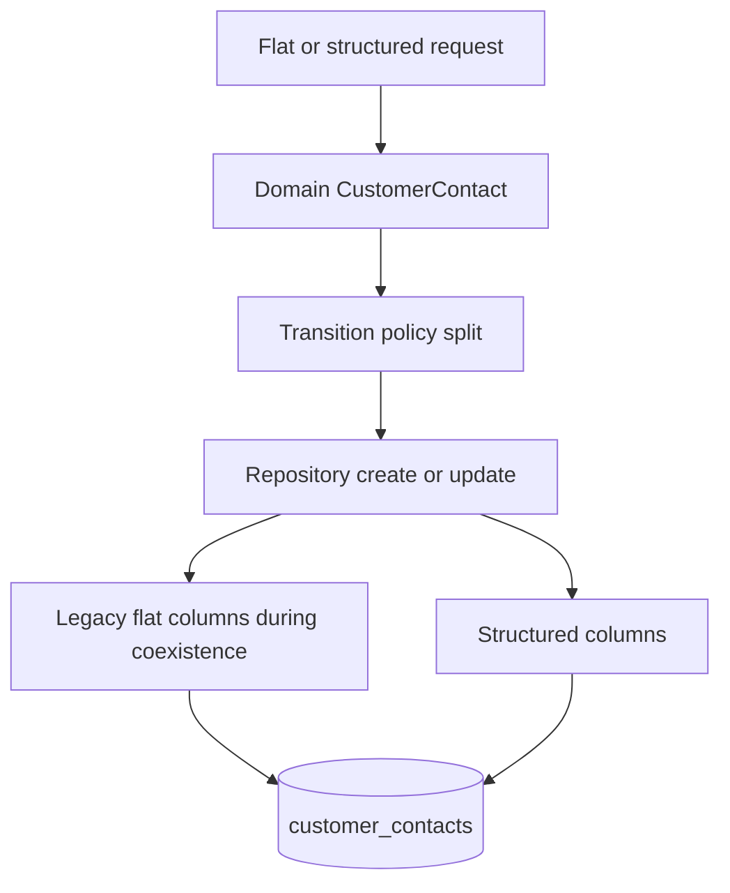
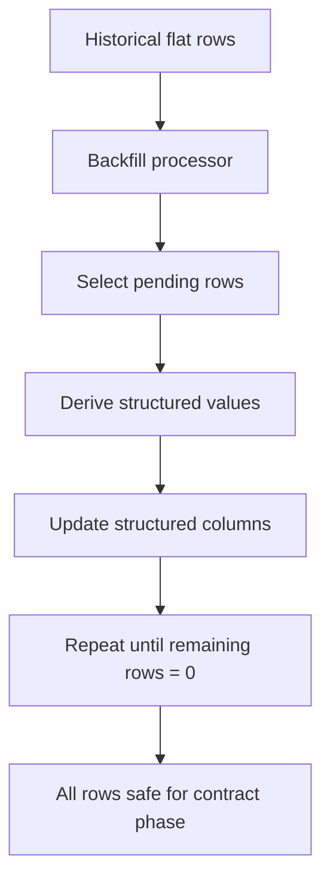
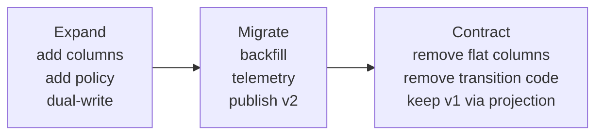
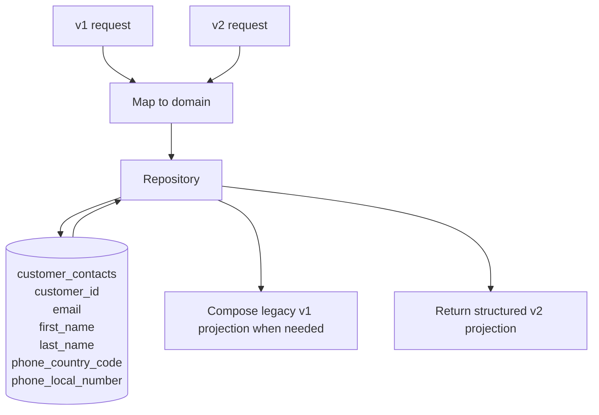

# Solution

## Objective

This document explains how the workshop repository was rebuilt into a coherent teaching baseline and then completed through the parallel change lifecycle.

The work had two equally important goals:

- preserve a trustworthy workshop starting point in `main`
- preserve a rigorous solution narrative in `solution` without mixing baseline hardening with migration-specific behavior

## Initial State And Constraints

At the start of the rewrite effort, the repository had two different kinds of work mixed together:

- baseline hardening needed by every student before starting the workshop
- parallel-change solution work that should appear only after the workshop begins

That mixture created several problems:

- `main` was not the true workshop baseline
- `solution` contained commits that really belonged in `main`
- one mixed commit (`ab1a856`) combined baseline migration-harness work and solution-only schema expansion work
- author and committer identity had to be normalized to `Emmanuel Valverde Ramos <evalverde@domingoalonsogroup.com>`
- the history needed to stay pedagogically readable, not just technically correct

The repository constraints also shaped the implementation:

- accepted AC in `to-do.md` could not be weakened
- `main` had to remain a stable initial state with only `v1` public endpoints plus system endpoints
- `solution` had to tell the full expand/migrate/contract story
- every phase had to be validated with executable evidence

## Why Direct Replacement Would Be Unsafe

Directly editing the existing shared branches would have been unsafe for both technical and teaching reasons.

Technical risk:

- it would be too easy to lose the ancestry proof that `solution` starts from the final sanitized `main`
- mixed commits would remain mixed even if the final tree looked correct
- already-shared history would become difficult to audit after broad in-place surgery

Teaching risk:

- students would start from a branch that already contains solution concerns
- the workshop chronology would stop matching the intended expand/migrate/contract progression
- moved baseline improvements would look like solution behavior instead of workshop prerequisites

The safer approach was branch reconstruction and controlled replay.

## Why Baseline Hardening Had To Move To `main`

The workshop starts from `main`, so anything needed by every student had to live there.

That includes:

- executable script hardening
- CI and local `act` validation structure
- deterministic fast-test flow
- integration schema setup through baseline migrations
- documentation and developer-experience hardening

If those changes stayed only in `solution`, then the workshop baseline would be weaker than the solution branch, which would make the exercise misleading.

## Rewrite Strategy

The repository was reconstructed in two stages:

1. rebuild `main` as the authoritative baseline
2. rebuild `solution` directly on top of the final published sanitized `main`

This preserved four guarantees:

- `main` is baseline-only
- `solution` begins strictly after the final `main` head
- every moved or split commit remains auditable
- no hidden ancestry from the old `solution` branch is reused

## Main Reconstruction

The sanitized `main` branch was rebuilt and then published to GitHub.

Baseline reconstruction evidence:

- rewrite map: `main-rewrite-map.md`
- published remote head: `539b338`
- remote: `git@github.com:evalverde-eng/aida-parallel-changes-workshop.git`

Important baseline moves and adjustments:

- `a491b90` was moved to `main` as `30fc955` because integration tests in the primary flow are baseline hardening, not solution behavior
- `ab1a856` was split; its baseline-only part became `da4512b`
- a new baseline hardening commit `ccd8f8e` enforced explicit planning confidence and no-assumption rules
- a final baseline fix `539b338` restored the intended separation between fast tests and narrow integration verification

## Solution Reconstruction

The sanitized `solution` branch was rebuilt from published `main` head `539b338`, not from the previous `solution` ancestry.

Solution reconstruction evidence:

- rewrite map: `solution-rewrite-map.md`
- rebuilt branch: `rewrite/solution-sanitized`

Rebuilt solution chronology:

| Phase | Rewritten commit | Purpose |
| --- | --- | --- |
| expand | `536edac` | add solution-specific AC and next red test |
| expand | `829a5d8` | add additive structured columns and split migration assertions |
| expand | `e5ff934` | define deterministic split and compose policy |
| expand | `41a3be4` | implement dual-write and transitional read |
| migrate | `f4bddfb` | add idempotent backfill and migration telemetry |
| migrate | `83435ae` | publish `v2` contract in parallel |
| contract | `3d665d2` | add contract-phase persistence and `v1` non-regression evidence |
| contract | `ab3d4bf` | switch to structured-only persistence and remove legacy columns |
| contract | `ff10f6e` | isolate explicit integration validation and local `act` support |

The first solution-only commit `536edac` has parent `539b338`, which proves the rebuilt solution starts exactly from the published sanitized baseline.

## Commit Chronology With Phase Boundaries

### Baseline Phase In `main`

The baseline history includes the original workshop bootstrap, API, persistence, scripts, docs, tests, CI, and local validation hardening.

The important final baseline boundary is:

- `539b338` `build: separate fast tests from integration verification`

That is the published workshop starting point.

### Expand Phase In `solution`

The expand phase introduces the new structure without breaking the old surface:

- solution-specific AC documented in `to-do.md`
- additive migration `202604010002`
- transition policy for splitting and composing names and phones
- dual-write persistence so flat and structured representations stay aligned

### Migrate Phase In `solution`

The migrate phase completes coexistence and forward movement:

- idempotent backfill for rows created before dual-write
- migration telemetry from the migrator
- public `v2` endpoints, contracts, mappers, acceptance tests, and `.http` files

### Contract Phase In `solution`

The contract phase completes the transition and removes transitional storage behavior:

- contract evidence first
- final migration `202604010003_RemoveLegacyFlatCustomerContactColumns`
- structured-only SQL writes and reads
- `v1` behavior preserved through projection from structured columns
- transition-only backfill processor removed
- explicit `v1` non-regression acceptance evidence added
- explicit narrow-integration scripts and workflow support added for solution validation

## Expand Phase Walkthrough

### `536edac` - solution branch AC and next red test

This commit marks the point where `solution` becomes a teaching branch rather than a baseline branch.

It records migration-specific acceptance criteria in `to-do.md` and sets the next red test so the branch continues under TDD discipline.

### `829a5d8` - additive structured columns

This is the solution-side split of mixed commit `ab1a856`.

It adds migration `202604010002_AddStructuredCustomerContactColumns` and the integration assertions that prove the new nullable columns exist while the old storage still remains intact.

This split was necessary because the original mixed commit combined:

- baseline migration harness proof
- solution-only schema expansion

Those are different intentions and belong on different branches.

### `e5ff934` - deterministic split and compose policy

This commit introduces the explicit rules used to derive structured fields from flat input and to compose legacy output when required.

That keeps the transformation deterministic and testable instead of scattering string manipulation through repository code.

### `41a3be4` - dual-write and transitional read

This commit is the core of the expand stage.

It makes the repository write both shapes while still allowing `v1` reads to succeed across mixed row states.

The repository becomes the compatibility boundary, which keeps the application and transport layers simpler.

## Migrate Phase Walkthrough

### `f4bddfb` - idempotent backfill and telemetry

This commit adds the batch backfill processor and migrator telemetry so old rows can be completed safely.

The design matters because migration work is not just schema work; it also has to cope with historical data already stored in the old shape.

Idempotence was essential here so repeated runs remain safe.

### `83435ae` - publish `v2` contract in parallel

This commit exposes the structured `v2` contract while keeping `v1` alive.

It adds:

- `v2` controllers
- `v2` request and response contracts
- `v2` mappers
- acceptance tests for `GET`, `POST`, and `PUT`
- `.http` coverage for success and failure outcomes

This is the phase where the new external contract becomes visible, but the old contract still remains supported.

## Contract Phase Walkthrough

The contract phase now exists as explicit commits on top of the rebuilt solution branch instead of remaining as local-only state.

### `3d665d2` - contract evidence first

This commit adds the contract-phase proof before changing production code.

It introduces:

- `SI-CONTRACT-DB-001`
- `AT-V1-NONREG-002`
- `to-do.md` updates that close `S-AC-11`

That keeps the contract work aligned with the repository's TDD rule: observable evidence first, implementation second.

### Internal persistence contract

### `ab3d4bf` - structured-only canonical persistence

The final persistence state removes the flat legacy columns entirely.

Changes made:

- added `202604010003_RemoveLegacyFlatCustomerContactColumns`
- removed `contact_name` and `phone` from SQL create, update, and read queries
- removed flat properties from `CustomerContactV1Row`
- kept `v1` response behavior by composing `contactName` and `phone` from structured fields

This means the system no longer stores the flat shape internally, but `v1` clients still observe the same behavior.

### Transitional code removal

Once the final persistence contract was in place, transition-only code stopped being correct.

So the contract phase also removed:

- `StructuredCustomerContactBackfillProcessor`
- backfill execution from the migrator

At that point, the branch has crossed the point where transition helpers are no longer part of the intended final state.

### `ff10f6e` - explicit integration validation and local `act` support

The final solution cannot rely on fast tests alone because database and migration regressions would be too easy to hide.

So the contract phase also adds:

- `scripts/test-integration.sh`
- `scripts/test-integration.ps1`
- `verify` integration execution through those scripts
- workflow scope `integration`
- `act` compatibility for Testcontainers using explicit host override handling

That keeps the fast path fast while making integration validation explicit and repeatable before publication.

## How TDD Was Used

The work followed outside-in double-loop TDD.

Key pattern:

- update `to-do.md`
- choose exactly one next red test
- make that one test fail for the right reason
- implement the minimum change to go green
- rerun the affected scope
- only then move to the next step

Examples from this rewrite:

- `SI-CONTRACT-DB-001` was added first to force migration `202604010003`
- after the schema contract went green, affected-scope validation exposed remaining transition assumptions
- those assumptions were then removed, and `AT-V1-NONREG-002` was added to prove `v1` still behaves correctly

This approach kept the contract phase honest: the code was shaped by observable evidence rather than by speculative refactoring.

## Alignment Across Docs, Tests, Scripts, OpenAPI, And HTTP Files

One of the repository's main rules is coherence across every artifact.

That coherence was preserved in these ways:

- `to-do.md` recorded baseline AC, solution AC, and the active next red test
- acceptance tests and integration tests matched the same branch-specific behavior claimed in the plan
- `.http` files were kept for both `v1` and `v2` outcomes during coexistence
- `scripts/test.*` and `scripts/verify.*` were corrected so fast-suite and narrow-integration behavior matched workflow expectations
- `scripts/test-integration.*` became the explicit narrow-integration entry point for solution validation and local `act`
- `scripts/smoke.*` exercised the live container path against the implemented API contracts
- OpenAPI and controller behavior remained aligned through the phase transitions
- the migrator matched the active phase: it performed backfill in migrate, then only schema migration after contract completion

## Why Each Moved Or Split Commit Was Necessary

### `a491b90` moved to `main`

Reason:

- integration tests in the primary flow are baseline quality hardening
- students need that behavior before solution work starts

### `ab1a856` split across `main` and `solution`

Reason:

- the baseline part proves migration harness correctness and belongs in `main`
- the additive structured migration is solution behavior and belongs in `solution`

Without the split, both branches would tell the wrong story.

### `539b338` added to sanitized `main`

Reason:

- it restored the intended contract that fast tests stay fast and narrow integration remains explicit in `verify`
- that change was also necessary to make local `act` validation reliable for the workshop baseline

## Validation Evidence

### Sanitized `main`

Validated successfully before publication with:

- Release build
- deterministic fast-suite runs
- narrow integration runs
- coverage `100%`
- mutation `100%`
- Docker `up/smoke/down`
- local `act` scopes `build`, `tests`, and `mutation`

### Rebuilt `solution`

Contracted solution validation currently includes:

- Release build
- full test suite `97/97`
- explicit narrow integration script on host
- local `act` fast-tests scope and integration scope
- Docker-backed `./scripts/up.sh && ./scripts/smoke.sh && ./scripts/down.sh`

## Required Diagrams

### Commit Timeline

### `v1` And `v2` Coexistence Sequence

### Dual-Write Persistence Flow

### Backfill And Completion Flow

### Expand / Migrate / Contract Progression

### Final Canonical Persistence State

## Final State Summary

The final intended end state is now explicit:

- `main` is a clean workshop baseline
- `solution` starts from that published baseline, not from stale ancestry
- expand and migrate are preserved as readable workshop phases
- contract removes flat internal storage while preserving `v1` observable behavior
- the repository remains validated through build, tests, scripts, HTTP smoke, coverage, mutation, and local workflow execution

That combination is what makes the result both production-rigorous and workshop-usable.
