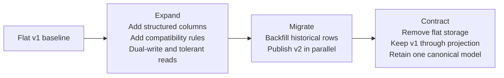
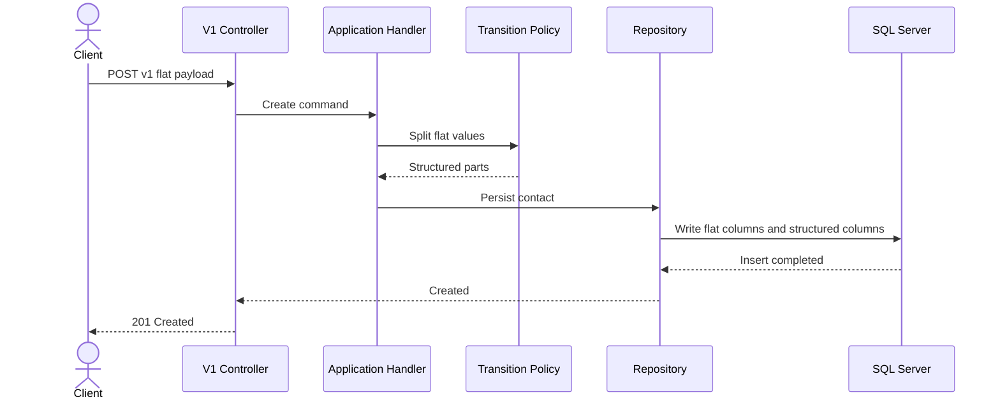
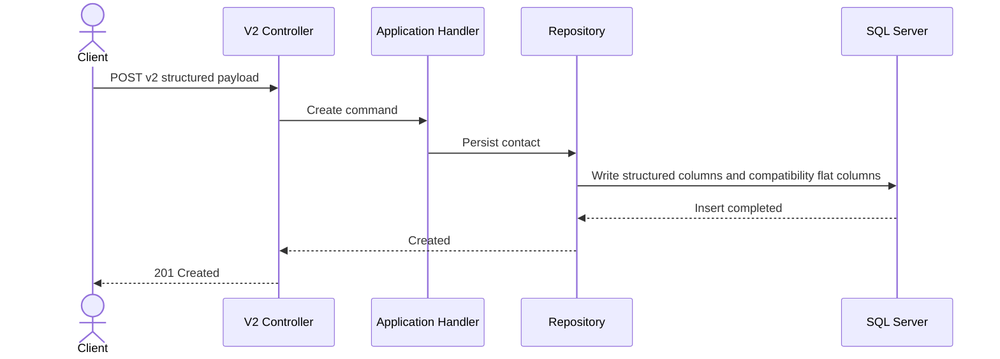
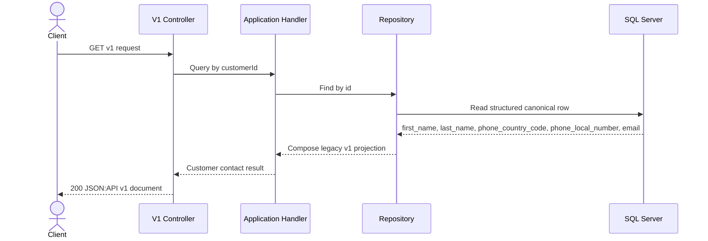
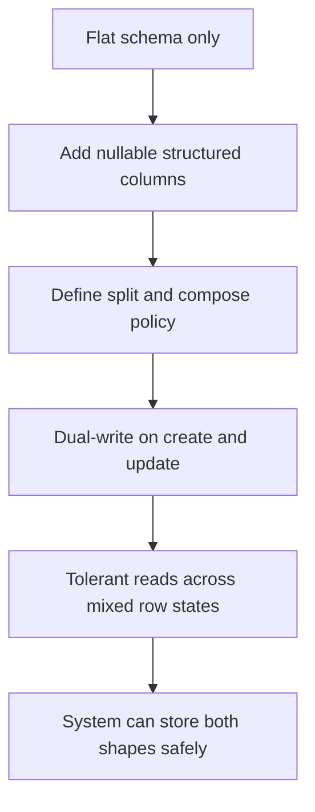
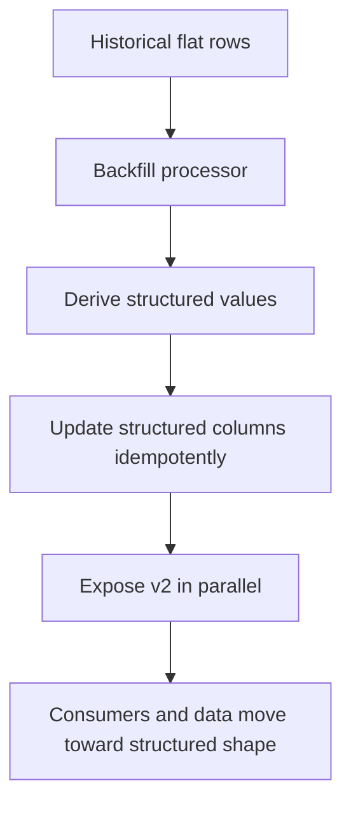
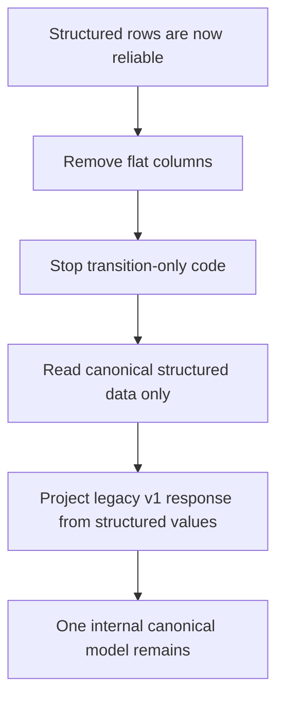

# Solution

## What This Branch Teaches

This branch is the didactic walkthrough of a parallel change applied to a live HTTP API and its persistence model.

The initial state at clean baseline `539b338` is simple:

- the public contract is `v1`
- persistence stores `contact_name` and `phone`
- all callers depend on that flat representation

The target state is different:

- persistence becomes structured and canonical
- a new `v2` contract is published in parallel
- `v1` remains observable while the system evolves internally
- the final contracted state removes legacy flat storage instead of keeping two permanent sources of truth

The branch exists to teach why that evolution is safer in phases than in one replacement step.

## Why Parallel Change Is The Chosen Strategy

The branch uses the classic three-part strategy:

1. `expand`
2. `migrate`
3. `contract`

That strategy is chosen because the system has to solve two compatibility problems at once:

- contract compatibility for clients
- persistence compatibility for already-stored rows

### Alternatives Considered At Strategy Level

#### Replace `v1` with `v2` immediately

Rejected because:

- existing clients would break
- the branch would skip the central lesson of coexistence
- data migration and contract migration would be forced into one risky moment

#### Change persistence internally but never publish `v2`

Rejected because:

- it solves storage evolution but not contract evolution
- it removes the public coexistence problem that students need to understand

#### Keep flat and structured storage forever

Rejected because:

- it creates two competing internal truths
- it turns a temporary transition into permanent complexity
- it avoids the most important final step: deliberately finishing the migration

The chosen strategy is the only one that keeps the system usable while still converging to a cleaner final state.

## Parallel Change At A Glance

## HTTP Request Diagrams

### `POST /api/v1/customer-contacts` During Coexistence

### `POST /api/v2/customer-contacts` During Coexistence

### `GET /api/v1/customer-contacts/{customerId}` After Contract

## Phase Diagrams

### Expand

### Migrate

### Contract

## Solution Commit Map

This is the ordered solution sequence students should follow from the clean `main` baseline.

| Order | Hash | Type | Message | Why it exists |
| --- | --- | --- | --- | --- |
| 1 | `536edac` | expand | `[expand] docs: add solution branch AC and next red test` | define the next safe target before changing behavior |
| 2 | `829a5d8` | expand | `[expand] feat: add structured nullable columns with additive migration` | create space for the new model without breaking the old one |
| 3 | `e5ff934` | expand | `[expand] feat: add deterministic split and compose transition policy` | define one compatibility rule for flat and structured values |
| 4 | `41a3be4` | expand | `[expand] feat: implement repository dual-write and transitional read` | make coexistence operationally safe |
| 5 | `f4bddfb` | migrate | `[migrate] feat: add idempotent backfill flow and migration telemetry` | move historical rows toward the new shape |
| 6 | `83435ae` | migrate | `[migrate] feat: publish v2 customer-contact contract in parallel` | let clients adopt the new contract gradually |
| 7 | `9c0686a` | contract | `[contract] feat: switch to structured canonical persistence and preserve v1 observable behavior` | remove flat storage while preserving the old public view |
| 8 | `097216f` | support during contract stage | `[contract] build: isolate explicit integration validation for solution and local act` | make the most fragile validation path explicit and reproducible |
| 9 | `5cc5e6f` | support | `build: scope Testcontainers host override to act only` | keep CI truthful without misclassifying the change as a phase step |
| 10 | current tip | support | `docs: rewrite solution guide as didactic parallel-change narrative` | explain the branch to students in the same order the branch evolves |

The last two entries are intentionally not tagged as `expand`, `migrate`, or `contract` because they are support work, not domain-evolution steps.

## Commit-By-Commit Walkthrough

## `536edac` - `[expand] docs: add solution branch AC and next red test`

### What Changed

- the solution branch recorded its own acceptance target and next red test

### Why It Changed Here

The branch needs a concrete statement of intent before it starts changing the system. Otherwise later commits would still modify code, but students would not know what question those commits were trying to answer.

### Why It Is `expand`

It starts the branch-specific change journey without removing or replacing anything. It opens the solution path.

### Alternatives Considered And Rejected

#### Start coding the schema change immediately

Rejected because:

- later decisions would look arbitrary
- the branch would teach implementation before intent

#### Start by publishing `v2`

Rejected because:

- the internal coexistence work does not exist yet
- the new contract would arrive before the system is ready to support it safely

## `829a5d8` - `[expand] feat: add structured nullable columns with additive migration`

### What Changed

- the schema gained:
  - `first_name`
  - `last_name`
  - `phone_country_code`
  - `phone_local_number`
- the old flat columns stayed in place

### Why It Changed Here

The new model needs somewhere to live before the application can start using it. The safest first move is additive, not destructive.

### Why It Is `expand`

The schema becomes larger, not smaller. Both representations can still coexist.

### Alternatives Considered And Rejected

#### Replace `contact_name` and `phone` immediately

Rejected because:

- existing rows would stop matching the application assumptions
- `v1` compatibility would break before coexistence logic exists

#### Store the new shape in one JSON column

Rejected because:

- it hides the domain split in a blob
- it weakens clarity, querying, and didactic value

#### Add non-null structured columns immediately

Rejected because:

- historical rows do not have structured values yet
- backfill has not happened yet

## `e5ff934` - `[expand] feat: add deterministic split and compose transition policy`

### What Changed

- the branch defined one explicit policy for:
  - splitting flat input into structured fields
  - composing legacy flat output from structured fields

### Why It Changed Here

Once the schema can hold both representations, the system needs one compatibility rule. If each adapter invents its own split and compose logic, the migration stops being deterministic.

### Why It Is `expand`

It adds new understanding and compatibility behavior without removing any current path.

### Alternatives Considered And Rejected

#### Put the compatibility rule in controllers

Rejected because:

- transport logic and transition logic would become mixed
- duplication risk would grow quickly

#### Put the compatibility rule directly in SQL mapping code

Rejected because:

- the transition rule would become infrastructure-specific
- it would be harder to explain and test in isolation

#### Use a more sophisticated parsing strategy from day one

Rejected because:

- the workshop needs deterministic, teachable rules
- the goal is safe evolution, not perfect natural-language parsing

## `41a3be4` - `[expand] feat: implement repository dual-write and transitional read`

### What Changed

- writes persist both flat and structured values during coexistence
- reads tolerate mixed row states

### Why It Changed Here

After additive schema and deterministic compatibility rules exist, the system has to make coexistence safe at runtime. New writes cannot choose only one representation and leave the other behind.

### Why It Is `expand`

The branch still supports both old and new shapes. It is extending safe behavior, not removing anything yet.

### Alternatives Considered And Rejected

#### Write only structured columns from this point onward

Rejected because:

- `v1` would still depend on data that is no longer maintained consistently

#### Keep writing only flat columns and postpone structured writes

Rejected because:

- the new model would exist only in schema, not in operational data

#### Build coexistence in controllers instead of the repository

Rejected because:

- the persistence boundary is where storage compatibility really belongs

## `f4bddfb` - `[migrate] feat: add idempotent backfill flow and migration telemetry`

### What Changed

- historical flat rows gained a migration path toward the structured shape
- migration telemetry was added
- the backfill process was made idempotent

### Why It Changed Here

Dual-write protects new rows, but it does nothing for rows already stored before coexistence started. The branch needs a deliberate migration step for historical data.

### Why It Is `migrate`

This is the first point where the system actively moves existing persisted state instead of merely tolerating both shapes.

### Alternatives Considered And Rejected

#### One large one-off SQL backfill

Rejected because:

- it is harder to observe safely
- it teaches a big-bang move instead of a controlled migration

#### Lazy backfill on reads

Rejected because:

- migration progress would become accidental and non-deterministic

#### No backfill at all

Rejected because:

- the database would never converge on one canonical internal shape

## `83435ae` - `[migrate] feat: publish v2 customer-contact contract in parallel`

### What Changed

- `v2` endpoints, contracts, mappers, tests, and `.http` examples were published
- `v1` remained available

### Why It Changed Here

The system is now internally capable of supporting the structured model, so the new external contract can be published without forcing all consumers to move at once.

### Why It Is `migrate`

The branch now migrates clients and traffic, not only data. The new contract becomes real while the old contract still works.

### Alternatives Considered And Rejected

#### Replace `v1` with `v2`

Rejected because:

- it would break existing consumers immediately

#### Delay `v2` until after contract

Rejected because:

- there would be no gradual consumer migration period

#### Publish `v2` before backfill and coexistence were ready

Rejected because:

- the internal model would not yet be safe enough to support the new contract consistently

## `9c0686a` - `[contract] feat: switch to structured canonical persistence and preserve v1 observable behavior`

### What Changed

- migration `202604010003_RemoveLegacyFlatCustomerContactColumns` removed the flat storage columns
- the repository stopped storing the flat representation as canonical data
- `v1` was preserved by projecting legacy values from structured fields
- transition-only backfill runtime behavior was removed

### Why It Changed Here

If the flat storage remains forever, the migration never finishes. This commit is the deliberate endpoint where the system keeps only one internal canonical representation.

### Why It Is `contract`

This is the phase where transitional storage is removed instead of merely tolerated.

### Alternatives Considered And Rejected

#### Keep both flat and structured columns forever

Rejected because:

- it leaves two competing internal truths in the system

#### Remove `v1` together with the flat columns

Rejected because:

- the branch still needs to preserve legacy observable behavior for existing consumers

#### Publish a red test-only contract commit in the final branch

Rejected because:

- the published line should remain executable and trustworthy for students

## `097216f` - `[contract] build: isolate explicit integration validation for solution and local act`

### What Changed

- explicit integration scripts were added
- `verify` started calling those scripts explicitly
- the workflow gained an `integration` scope
- readiness handling for the SQL path was made explicit

### Why It Changed Here

Once the branch reaches the contracted persistence state, the most fragile failures are no longer simple unit mistakes. They are integration failures involving SQL startup, migrations, Testcontainers, and real persistence semantics.

### Why It Was Added During The Contract Stage

This commit lands during the contract stage because it protects the final state, but the important didactic distinction is this: it is support work for a contracted system, not a domain-evolution step by itself.

### Alternatives Considered And Rejected

#### Keep integration checks hidden only inside `verify`

Rejected because:

- failures would be harder to isolate and explain

#### Put integration tests back into the fast suite

Rejected because:

- it would make the fast path slower and more fragile

#### Depend only on remote CI for integration evidence

Rejected because:

- local reproducibility would become weaker

## `5cc5e6f` - `build: scope Testcontainers host override to act only`

### What Changed

- the workflow stopped forcing `TESTCONTAINERS_HOST_OVERRIDE=host.docker.internal` in GitHub Actions host-runner mode
- the integration scripts kept `host.docker.internal` only for `ACT=true`
- the scripts defensively clear that override in GitHub-hosted runner mode if it is inherited incorrectly

### Why It Changed Here

This commit repairs a real CI failure on the latest solution tip. The failure was not a domain mistake. It was a mismatch between:

- local `act`, where tests run inside a container
- GitHub-hosted runners, where tests run on the host

The commit exists to keep the final branch truthful and green in real CI.

### Why It Is Not `expand`, `migrate`, Or `contract`

It does not evolve the domain model, the public contract, or the persistence contract. It repairs build and CI execution. Students should see it as support work, not as a new phase step.

### Alternatives Considered And Rejected

#### Force `localhost` immediately

Rejected as the first fix because:

- the strongest evidence pointed first to removing the wrong forced override

#### Rewrite earlier history immediately

Rejected because:

- the observed failure existed at the latest tip and could be fixed additively first

#### Replace Testcontainers with a service container immediately

Rejected because:

- it was a larger infrastructure change than the evidence required

## Support Work At The Tip

The final documentation commit is support work too, not a new phase of the parallel change.

Its purpose is to explain the branch clearly to students after the domain-evolution work is already complete.

That is why this documentation replay is intentionally named with `docs:` and not with `expand`, `migrate`, or `contract`.

## What Students Should Learn From This Branch

The most important lesson is not only the final tree. It is the order of decisions.

Students should learn to recognize this safe sequence:

1. define the change target
2. add the new shape without removing the old one
3. centralize compatibility rules
4. make coexistence operationally safe
5. migrate historical data deliberately
6. publish the new contract in parallel
7. contract the internal model to one canonical shape
8. make the final-state validation explicit
9. keep support work clearly separate from domain-phase work

That separation is what makes the branch both technically rigorous and didactically useful.
